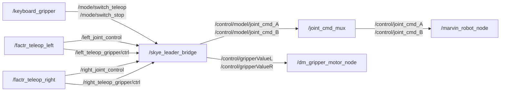

# Marvin 遥操小臂 ROS2 Topic Analysis

采集时间：2026-07-23

采集环境：ROS 2 Humble。`source install/setup.bash` 只加载环境，不启动遥操节点。当前 domain 里可见的是底盘/SLAM/导航 topic，遥操小臂 topic 需先 `ros2 launch` 后才出现。

启动命令：

```bash
source install/setup.bash
ros2 launch factr_teleop start_teleop_m6_dual.launch.py
# 可选：ros2 launch robot_driver robot_servo_start_marvin.launch.py
```

检查命令：

```bash
ros2 node list
ros2 topic list -t
ros2 topic info -v /left_joint_control
ros2 topic info -v /right_joint_control
```

当前/预期节点：

| Node | 说明 |
|---|---|
| `/factr_teleop_left` | 左遥操小臂 Dynamixel 驱动；重力补偿；发布 `/left_joint_control` |
| `/factr_teleop_right` | 右遥操小臂 Dynamixel 驱动；重力补偿；发布 `/right_joint_control` |
| `/keyboard_gripper` | 键盘模式切换：1=sync，2=teleop，3=stop |
| `/robot_servo_driver` | Marvin M6 follower 伺服驱动（本机/容器可选，Skye 正式链路通常用 `/marvin_robot_node`） |
| `/initjoint_publisher` | 发布初始关节位姿 |
| `/left_gripper` / `/right_gripper` | Robotiq/ChangingTek 夹爪节点（`use_*_gripper:=true` 时启动） |
| `/skye_leader_bridge` | Skye 侧桥接：小臂 joint/gripper → `/control/model/*` 与夹爪命令 |
| `/joint_cmd_mux` | 关节命令多路选择：`-1=idle`，`0=teleop_ik`，`1=model`，`2=replay` |
| `/marvin_robot_node` | Skye 低层机器人接口 |
| `/dm_gripper_motor_node` | Skye 夹爪电机节点 |

## Topic Table

| Topic | Type | 发布者 | 订阅者 | 说明 |
|---|---|---|---|---|
| `/left_joint_control` | `sensor_msgs/msg/JointState` | `/factr_teleop_left` | `/skye_leader_bridge` | 左小臂 7 轴关节目标，桥接到 Skye |
| `/right_joint_control` | `sensor_msgs/msg/JointState` | `/factr_teleop_right` | `/skye_leader_bridge` | 右小臂 7 轴关节目标，桥接到 Skye |
| `/left_joint_state` | `sensor_msgs/msg/JointState` | `/factr_teleop_left` | 录制/可视化脚本 | 左小臂自身关节状态 |
| `/right_joint_state` | `sensor_msgs/msg/JointState` | `/factr_teleop_right` | 录制/可视化脚本 | 右小臂自身关节状态 |
| `/left_joint_move` | `sensor_msgs/msg/JointState` | 同步/走位链路 | `/factr_teleop_left` | 左小臂走位/同步目标 |
| `/right_joint_move` | `sensor_msgs/msg/JointState` | 同步/走位链路 | `/factr_teleop_right` | 右小臂走位/同步目标 |
| `/left_teleop_gripper/ctrl` | `sensor_msgs/msg/JointState` | `/factr_teleop_left` | `/skye_leader_bridge`，可选本地夹爪 | 左夹爪归一化命令 `[0,1]` |
| `/right_teleop_gripper/ctrl` | `sensor_msgs/msg/JointState` | `/factr_teleop_right` | `/skye_leader_bridge`，可选本地夹爪 | 右夹爪归一化命令 `[0,1]` |
| `/left_gripper/state` | `sensor_msgs/msg/JointState` | 左夹爪节点 | `/factr_teleop_left` | 左夹爪反馈 |
| `/right_gripper/state` | `sensor_msgs/msg/JointState` | 右夹爪节点 | `/factr_teleop_right` | 右夹爪反馈 |
| `/mode/switch_sync` | `std_msgs/msg/String` | `/keyboard_gripper` | 遥操控制链路 | 小臂同步到大臂当前位置 |
| `/mode/switch_teleop` | `std_msgs/msg/String` | `/keyboard_gripper` | `/skye_leader_bridge` | 使能遥操输出 |
| `/mode/switch_stop` | `std_msgs/msg/String` | `/keyboard_gripper` | `/skye_leader_bridge` | 停止遥操输出 |
| `/control/model/joint_cmd_A` | `marvin_msgs/msg/JointcmdArm` | `/skye_leader_bridge` | `/joint_cmd_mux` | 方案 B：左臂 model 源 |
| `/control/model/joint_cmd_B` | `marvin_msgs/msg/JointcmdArm` | `/skye_leader_bridge` | `/joint_cmd_mux` | 方案 B：右臂 model 源 |
| `/control/joint_cmd_A` | `marvin_msgs/msg/JointcmdArm` | `/joint_cmd_mux` | `/marvin_robot_node` | 最终左臂关节命令 |
| `/control/joint_cmd_B` | `marvin_msgs/msg/JointcmdArm` | `/joint_cmd_mux` | `/marvin_robot_node` | 最终右臂关节命令 |
| `/control/gripperValueL` | `std_msgs/msg/Float32` | `/skye_leader_bridge` | `/dm_gripper_motor_node` | 左夹爪开合量 |
| `/control/gripperValueR` | `std_msgs/msg/Float32` | `/skye_leader_bridge` | `/dm_gripper_motor_node` | 右夹爪开合量 |
| `/info/joint_cmd_mux/active_source` | `std_msgs/msg/Int32` | `/joint_cmd_mux` | 监控节点 | mux 当前源：`-1/0/1/2` |

## Service / Action

| 名称 | Type | 说明 |
|---|---|---|
| `/control/joint_cmd_mux/select` | `marvin_msgs/srv/Int` | 切换关节命令源：`-1=idle`，`0=teleop_ik`，`1=model`，`2=replay` |
| `/control/set_mode` | 依 Skye 图而定 | 切控制模式（阻抗等），桥接前必须可用 |
| `/control/set_vel_ratio` | 依 Skye 图而定 | 速度比例，可选 |
| `/control/set_ready` / `/control/clear_fault` | 依 Skye 图而定 | ready/清故障，可选 |

遥操小臂 `factr_teleop` 本身以 topic 为主，无业务 action。当前 domain 里可见的 `/move/*`、`/slam/*`、`/navigation/*` action/service 属于底盘导航，与遥操无关。

## Main Flow



## Notes

- 主链路：`factr_teleop_* -> skye_leader_bridge -> joint_cmd_mux(source=1 model) -> marvin_robot_node`。
- `source install/setup.bash` 不会启动节点；双臂入口是 `start_teleop_m6_dual.launch.py`。
- 正式方案 B 必须用 `skye_leader_bridge_mux.yaml`，输出到 `/control/model/joint_cmd_*`，不要直发 `/control/joint_cmd_*`。
- 上机顺序：低层驱动 → mux → bridge → 小臂 launch → `/mode/switch_teleop` → mux 切到 `model(1)`。
- Dynamixel 端口写在 `grav_comp_m6_left/right.yaml`，上机前用 `ls /dev/serial/by-id/` 核对。
